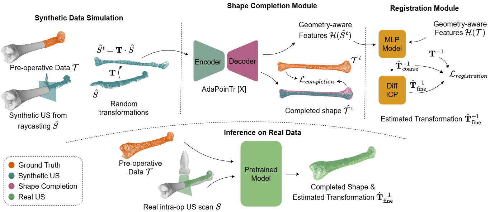

# ComReg — Shape-Aware Registration Without Pretraining: CT–Ultrasound Bone Surface Alignment via Instance-Level Shape Completion

> Official implementation of
> **“Shape-Aware Registration Without Pretraining: CT–Ultrasound Bone Surface Alignment via Instance-Level Shape Completion.”**
> Luohong Wu, Elise Cho, Yunke Ao, Lennard Marx, Nicola Cavalcanti, Yiru Yang, Matthias Seibold, Philipp Fürnstahl.
> Research in Orthopedic Computer Science (ROCS), Balgrist University Hospital, University of Zurich.

[](LICENSE)

**ComReg** registers a sparse, partial **intraoperative ultrasound (US)** bone-surface
point cloud to the corresponding **preoperative CT** bone, *without* requiring large paired
CT–US training datasets. Instead of learning cross-instance shape priors, ComReg is trained
**per patient** on synthetic US point clouds generated from that patient's own preoperative
CT, then applied directly to the real intraoperative US scan. Surface **completion** and
cross-modal **registration** are optimized jointly in a single end-to-end network, and a
learned coarse pose is refined by a fully **differentiable ICP** trained together with the
rest of the model.

On the publicly available [UltraBones100k](https://github.com/luohwu/UltraBones100k)
dataset, ComReg matches state-of-the-art *fully supervised, cross-instance* registration
methods while needing **no cross-instance data**, and runs in **< 1 s** per registration
(a single forward pass).



*Overview. **Preoperative (training):** synthetic US point clouds are generated by ray-casting
from the patient-specific CT bone model and used to train the shape-completion and registration
modules self-supervised. **Intraoperative (inference):** the real US scan is fed to the
pretrained model to obtain the completed shape and the estimated CT→US transformation.*


---

## Contents

- [How it works](#how-it-works)
- [Repository layout](#repository-layout)
- [Environment](#environment)
- [Dataset layout](#dataset-layout)
- [Running](#running)
- [Configuration](#configuration)
- [Citation](#citation)
- [License](#license)
- [Acknowledgements](#acknowledgements)

---

## How it works

ComReg comprises three modules, trained together (see figure above):

1. **Patient-specific synthetic US simulation**
   ([`generate_partial_pcd/us_pcd_synthesis_real_trajectory.py`](generate_partial_pcd/us_pcd_synthesis_real_trajectory.py)).
   From the preoperative CT bone model, a stochastic ray-casting process emulates a tracked
   freehand US sweep — keeping only the first ray–surface hit (acoustic shadowing) and
   injecting realistic perturbations (probe tilt, non-uniform sweep speed, dropped slices,
   segmentation noise). The simulator is invoked on demand by the dataloader and cached, so
   training/testing never requires running it by hand.

2. **Shape completion** — an [AdaPoinTr](https://github.com/yuxumin/PoinTr) backbone
   ([`models/AdaPoinTr.py`](models/AdaPoinTr.py)) takes the
   partial US cloud and produces a completed cloud plus geometry-aware decoded features,
   supervised by Chamfer Distance.

3. **Registration** — a coarse pose head
   ([`models/PoseFromRebuildFeature.py`](models/PoseFromRebuildFeature.py))
   regresses a coarse `SE(3)` pose from the concatenated completion features of the US and CT
   clouds, then a **differentiable ICP**
   ([`models/DiffICP.py`](models/DiffICP.py)) refines it. The
   total loss keeps completion dominant while scaling the registration term adaptively
   (`reg_loss_ratio`, ρ in the paper).

Metrics: coarse **RTE/RRE**, ICP-refined **RTE_ICP/RRE_ICP**, and at validation **CD/HD95**.

> `DiffICP` is a self-contained, batched, gradient-checkpointed, pure-PyTorch
> soft-correspondence + weighted-Procrustes (point-to-point) ICP. See the design notes at the
> top of [`models/DiffICP.py`](models/DiffICP.py).

---

## Repository layout

```
train.py                  # training entry point (Runner + DiffICP)
test.py                   # evaluation: load checkpoint, save completion/registration, print metrics
generate_partial_pcd/     us_pcd_synthesis_real_trajectory.py  (synthetic-US simulator)
models/                   AdaPoinTr, DiffICP, PoseFromRebuildFeature, Transformer_utils
Dataset/                  dataset_coupled.py  (DatasetCoupled_slice_wise)
utility/                  metrics (converter.py), logging, US denoising, misc helpers
confs/default.conf        HOCON config (parsed by utility/read_confs.py)
extensions/               chamfer_dist, pointnet2_ops_lib   (compiled at image build)
assets/overview.png       figure used in this README
Dockerfile, .devcontainer/                                  # CUDA 12.8 / PyTorch 2.7.1
```

---

## Environment

The project targets **CUDA 12.8 + PyTorch 2.7.1** (Ampere/Hopper and Ada/Blackwell GPUs). The
two local CUDA extensions (`chamfer_dist`, `pointnet2_ops_lib`) are compiled into the image,
so a container is the supported way to run.

### Option A — VS Code Dev Container (recommended)

Open the repo in VS Code with the Dev Containers extension and **Reopen in Container**. The
[`.devcontainer/devcontainer.json`](.devcontainer/devcontainer.json) builds the
[`Dockerfile`](Dockerfile), requests the GPU, and wires up the env vars and mounts. **Before
reopening, edit the dataset mount in the `"mounts"` array of
[`.devcontainer/devcontainer.json`](.devcontainer/devcontainer.json): set the `source=` of the
`/mnt/UltraBones100k` bind to your host copy of the dataset** (the commented line just above it
shows the format). The output mount defaults to the repo's sibling `../outs` and usually needs no
change.

### Option B — Docker directly

```bash
docker build -t comreg .
docker run --gpus all --shm-size=16g \
  -v /path/to/UltraBones100k:/mnt/UltraBones100k \
  -v "$(pwd)":/workspace -v "$(pwd)/../outs":/outs \
  -e ULTRABONES100K_ROOT=/mnt/UltraBones100k \
  -e PYTHONPATH=/workspace \
  -it comreg bash
```

### Environment variables

| Variable | Purpose | Default |
|---|---|---|
| `ULTRABONES100K_ROOT` | Dataset root (overrides `dataset.dataset_root_folder` in the conf) | `/path/to/UltraBones100k` |
| `PYTHONPATH` | Must include the repo root | — |
| `COMET_API_KEY` | Optional — enables [Comet ML](https://www.comet.com/) logging; omit to run without it | unset |
| `COMET_WORKSPACE` | Optional — Comet workspace for logging | account default |
| `COMET_PROJECT_NAME` | Optional — Comet project name | `comreg` |

---

## Dataset layout

ComReg is evaluated on **UltraBones100k** (Wu et al., *Comput. Biol. Med.* 2025,
[github.com/luohwu/UltraBones100k](https://github.com/luohwu/UltraBones100k)).
The dataset is **not** included here — obtain it separately and point `ULTRABONES100K_ROOT`
at a folder with this per-specimen structure (specimens `01`–`14`, anatomy `tibia` / `fibula`):

```
$ULTRABONES100K_ROOT/
  specimen01/
    CT_bone_segmentations/
      tibia.stl                                   # CT bone mesh (input)
      tibia.pt                                     # processed cache (auto-created on first run)
      tibia_simulated_slice_data_realtraj.npy      # simulated US slices  → TRAINING input (auto-generated)
    ultrasound_records/
      tibia/
        <record>/3D_reconstructions/with_pred_labels/
          reconstruction_pcd_filtered.xyz          # real US reconstruction → VALIDATION input
    ... (fibula likewise)
  specimen02/ ...
```

- **Training** consumes the simulated real-trajectory US clouds
  (`dataset.simulated_data_suffix = "_simulated_slice_data_realtraj.npy"`), generated on first
  use from each `{anatomy}.stl`.
- **Validation** consumes the real US reconstructions, DBSCAN-denoised
  (`dataset.denoise_intra = true`).
- On first run, each `{anatomy}.stl` is processed once into a `{anatomy}.pt` cache.

---

## Running

Both entry points iterate specimens × anatomy; the `--target_*` flags select a subset.

```bash
# train one specimen / one anatomy (writes checkpoints under base_exp_dir)
python train.py --target_specimen_id 2 --target_anatomy tibia

# evaluate a saved checkpoint — saves completion + registration results, prints metrics
python test.py --target_specimen_id 2 --target_anatomy tibia --epoch 150
```

### `train.py` flags

| Flag | Default | Meaning |
|---|---|---|
| `--target_specimen_id` | `-1` | Specimen to run; `<= 0` runs all `1`–`14` |
| `--target_anatomy` | `None` | `tibia`, `fibula`, or unset for both |
| `--gpu` | `0` | GPU index |
| `--resume_epoch` | `-1` | Resume from this experiment's `ckpt-<N>.pth`; `-1` or a missing file → from scratch |

**Resume (optional).** Pass `--resume_epoch <N>` to continue training from a checkpoint of
this experiment at
`{base_exp_dir}/{specimen}_{anatomy}/checkpoints/ShapeCompletion/ckpt-<N>.pth`. **If
`--resume_epoch` is `-1` (default) or no such checkpoint exists, training starts from
scratch** (a note is printed) — so a fresh clone runs end-to-end with no extra setup.

`train.py` trains for `max_epoch` (set in the conf; `300` in the shipped conf) and writes a
checkpoint every 50 epochs from epoch 100 — i.e. `ckpt-100.pth`, `ckpt-150.pth`, …, `ckpt-300.pth`.
Adjust `max_epoch` in the conf to train longer or shorter.

### `test.py` flags

`test.py` loads a checkpoint, runs the model on the real US validation clouds, **saves** the
completion and registration outputs, and **prints** the aggregate metrics
(CD / HD95 / RTE / RRE, the DiffICP-refined RTE_ICP / RRE_ICP, and CD_REG / HD95_REG).

| Flag | Default | Meaning |
|---|---|---|
| `--target_specimen_id` | `2` | Specimen to evaluate; `<= 0` runs all `1`–`14` |
| `--target_anatomy` | `fibula` | `tibia`, `fibula`, or unset for both |
| `--epoch` | `150` | Checkpoint epoch to load (`ckpt-<epoch>.pth`); use one that exists |
| `--ckpt` | unset | Explicit checkpoint path (overrides `--epoch` lookup) |
| `--n_runs` | `30` | Number of evaluation batches (random disturbances) |
| `--batch_size` | `4` | Clouds per batch |
| `--save_pcd_runs` | `10` | Save point clouds for the first N runs (`0` = metrics only) |
| `--passes` | `3` | Network passes with test-time re-orientation (`1` = single pass) |
| `--icp_iters` | `300` | DiffICP iterations at test time (overrides the conf's `n_iters`) |
| `--icp_n_points` | `4096` | DiffICP correspondence subsample; `0` = full resolution (no subsample) |
| `--icp_src` | `partial` | Geometry fed to ICP: the raw `partial` US input (as in the paper) or the `completed` shape |
| `--icp_sigma` | `0.001` | Soft-correspondence width at test time, in normalised units (training uses `0.005`) |
| `--icp_trim` | `0.1` | Trimmed-correspondence ratio at test time (training uses `0.2`) |

At test time, DiffICP aligns the US cloud with more selective soft correspondences
(σ = 0.001) and **300 iterations**, which are cheap without a gradient graph. Point-to-point ICP
only slowly slides a partial sweep along the shaft, so translation keeps improving with
iterations. Denser correspondence subsampling (more than 4096 points) did not help. Pass
`--passes 1 --icp_src completed --icp_sigma 0.005 --icp_iters 25 --icp_trim 0.2` for the
training-time settings.


### Outputs

Checkpoints and logs are written under the conf's `general.base_exp_dir`
(`./../outs/UltraBones100k/`),
i.e. `/outs/...` inside the container with the recommended mount.

`test.py` writes its results next to the checkpoints, under
`…/{specimen}_{anatomy}/evaluation/ckpt-{epoch}/`:

```
gt.ply                               ground-truth (CT) cloud, GT frame
sample_XXXX_input.ply                transformed intra (US) cloud  (network input)
sample_XXXX_completed.ply            completion output, in its OWN (input) frame — NOT registered
sample_XXXX_completed_registered.ply completion aligned to the CT frame by the ESTIMATED pose
sample_XXXX_registered.ply           input US aligned to the CT frame by the ESTIMATED pose
transforms.npz                       T_gt / T_coarse / T_icp for every sample
metrics.csv                          per-sample CD/HD95/RTE/RRE(+ICP)/CD_REG/HD95_REG
metrics_summary.txt                  mean ± std over all samples
```

Metrics (millimetres / degrees):

- `RTE`/`RRE`: coarse pose of network pass 1.
- `RTE_ICP`/`RRE_ICP`: final pose after DiffICP.
- `CD_REG`/`HD95_REG`: one-sided distance from the US registered by the final pose to the CT
  cloud.
- `CD`/`HD95`: completion (last pass), placed with the GT pose.

RRE is measured after projecting both rotations onto SO(3). A slightly non-orthonormal estimate
otherwise pushes `(trace - 1) / 2` past 1, and the clip reports exactly 0°.

---

## Configuration

All knobs live in [`confs/default.conf`](confs/default.conf)
(HOCON, parsed by [`utility/read_confs.py`](utility/read_confs.py)). The most relevant blocks:

- **`dataset`** — `dataset_root_folder` (env-overridable), `npoints_gt` / `npoints_input`,
  batch size `bs`, `dataset_len`, perturbation ranges (`max_rotation_deg`, `max_translation`),
  `simulated_data_suffix`, `denoise_intra`.
- **`diff_icp`** — the differentiable ICP. Defaults (tuned for partial-US → full-CT):
  `n_iters=25`, `n_points=2048`, soft correspondences with constant `sigma=0.005`,
  `trim_ratio=0.2` (robust outlier rejection), `grad_checkpoint=true`,
  `lambda_coarse=1`, `lambda_fine=0.5`.
  - `lambda_fine=0` trains coarse-only but still reports ICP-refined metrics at validation.
  - `lambda_fine>0` additionally backprops through the ICP iterations (slower; co-adapts the
    model to ICP).
  - `hard=true` switches soft ICP for standard nearest-neighbor ICP.
- **`reg_loss_ratio`** (ρ) — the registration term is scaled adaptively so it contributes this
  fraction of the completion-loss magnitude (`0.1` by default), keeping completion dominant.

---

## Citation

If you use this code, please cite:

```bibtex
@InProceedings{10.1007/978-3-032-38186-6_29,
author="Wu, Luohong,
Cho, Elise,
Ao, Yunke,
Marx, Lennard,
Cavalcanti, Nicola A.,
Yang, Yiru,
Seibold, Matthias,
F{\"u}rnstahl, Philipp",
title="Shape-Aware Registration Without Pretraining: CT-Ultrasound Bone Surface Alignment via Instance-Level Shape Completion",
booktitle="Medical Image Computing and Computer Assisted Intervention -- MICCAI 2026",
year="2027",
publisher="Springer Nature Switzerland",
address="Cham",
pages="301--311",
isbn="978-3-032-38186-6"
}
```

Please also cite the dataset and the completion backbone you rely on:

- **UltraBones100k** — Wu et al., *Comput. Biol. Med.* (2025).
  [github.com/luohwu/UltraBones100k](https://github.com/luohwu/UltraBones100k)
- **AdaPoinTr / PoinTr** — Yu et al., *IEEE TPAMI* (2023). https://github.com/yuxumin/PoinTr

---

## License

Released under the [MIT License](LICENSE). This repository bundles or adapts third-party
components (AdaPoinTr/PoinTr, `pointnet2_ops`, `chamfer_dist`) under their own permissive
licenses; see the file headers and upstream projects for details.

---

## Acknowledgements

The shape-completion backbone builds on [AdaPoinTr / PoinTr](https://github.com/yuxumin/PoinTr),
and the CUDA extensions adapt `pointnet2_ops` and `chamfer_dist` from the same lineage. We thank
the authors for releasing their work.
